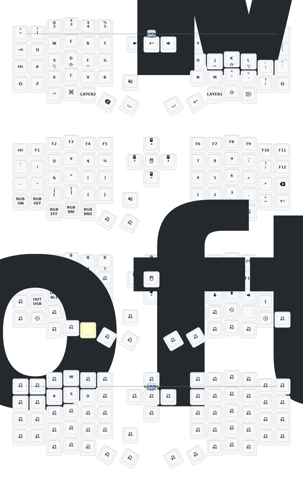

# Update List

- 2026/6/5
  1. Adapted to dyastudio.
- 2025/8/22
  1. Updated soft off. Holding Q, S and Z together for 2 seconds puts the keyboard into deep sleep, which cannot be woken by a key press. Useful when carrying it around. To activate, press the reset switch once.
  2. Updated the low-profile Sofle and Corne cases this month. The frame and bottom plate are thicker, and the reset switch opening has been adjusted so it can be pressed easily. Still figuring out how to design a case with a tilt stand. If you've inspected the PCB closely, you'll notice reserved headers for IO expansion - not sure if anyone will end up using them, but I'll give it a try myself!
  3. Removed the GIF animation on the right keyboard's screen, which significantly reduces its power consumption.
- 2025/3/30 Increased sleep entry time to 1 hour, increased debounce time, optimized post-sleep power consumption.
- 2024/12/21
  1. Added support for zmk-studio (just refresh the left hand to use).
- 2024/10/24
  1. Modified power supply mode to reduce power consumption.
  2. Fixed the automatic shut-off feature for RGB power supply.

> If your keyboard was updated before October 24, please update to the latest firmware.
> 
---
# Contact Me

For 3D printed model files or any issues and malfunctions with the keyboard, please contact 380465425@qq.com

# Sofle Keymap

